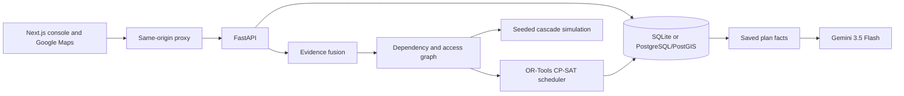

# STORMCHAIN-X

**Cyclone recovery planning when the reports are incomplete.**

After a cyclone, a road report may arrive late, two sources may disagree about
a substation, or an asset may have no report at all. STORMCHAIN-X keeps those
cases visible while it maps infrastructure dependencies and schedules repairs
within a budget and available crews. Add a report, recalculate, and compare the
new plan with the saved one.

**[Open the live demo](https://stormchain-web-70530354318.asia-south1.run.app/)**

Built by team Vyntra for the Cyclone Impact & Infrastructure Vulnerability
Forecaster track. The district, assets, reports, costs, and repair times are
synthetic. It is decision support, not a system that operates real infrastructure.

## What it does

- **Keeps uncertainty visible.** An asset with no report is *unknown*, never
  assumed destroyed. Each asset shows its status, confidence, and the evidence
  behind it.
- **Fuses conflicting evidence.** Reports are weighted by source reliability,
  the reporter's confidence, and age, so a stale or weak report counts for less.
- **Follows dependencies.** A hospital depends on power, water, and road access.
  The dependency graph shows what fails when an upstream asset does.
- **Schedules repairs.** A constraint solver picks feasible repair actions under
  a budget, crew limits by type (electrical, civil, generator), and road access.
- **Compares plans.** Every plan is saved with the evidence it used. After a new
  report, the console shows which actions were added, removed, or rescheduled.
- **Explains the plan.** Gemini answers questions about a saved plan and cites
  the stored records behind its answer.

## Try it

1. Select an asset on the map. Inspect its observations, confidence, and
   dependencies.
2. Generate a recovery plan. Check the chosen actions, budget, crews, road
   prerequisites, and solver status.
3. Report a blocked **Highway 101 (synthetic)** and recalculate. The comparison
   shows what changed. The result comes from the saved evidence and solver, so a
   change is not guaranteed.
4. Ask Gemini why the plan looks the way it does. Open **Saved facts cited** to
   see the records behind the answer.

The scenario has ten synthetic assets (hospitals, shelters, a water plant,
substations, a communications tower, roads, a depot), a ₹25,00,000 (25 lakh) budget,
degraded communications, and three electrical, two civil, and two generator
crews.

## How it works



1. **Evidence fusion** combines reports into a status and confidence per asset.
2. **The graph** models typed dependencies and road access between assets.
3. **Seeded Monte Carlo runs** explore how failures cascade. The same seed gives
   the same result.
4. **The CP-SAT scheduler** chooses repair actions that satisfy budget, crew,
   and access constraints. It reports whether the solution is optimal, feasible,
   or infeasible.
5. **Gemini** explains the saved plan. It selects a bounded set of read-only
   records, and the API rejects any citation that is not in the saved snapshot.
   Gemini never sets failure probabilities or chooses the schedule.

The verification list is a heuristic (criticality × uncertainty), not a formal
value-of-information calculation. Monte Carlo uses the Python standard library on
purpose. NumPy and GeoPandas were not needed for a graph this size, and leaving
them out keeps the API image small.

## Stack

| Layer | Technology |
|---|---|
| Console | Next.js, TypeScript, Google Maps JavaScript API |
| API | Python 3.12, FastAPI, SQLAlchemy (async), Pydantic |
| Data | SQLite for the demo, PostgreSQL/PostGIS for containers |
| Engine | NetworkX graph, seeded Monte Carlo, OR-Tools CP-SAT |
| AI | Gemini 3.5 Flash through Vertex AI or the Gemini API |
| Hosting | Google Cloud Run (API and console) |

## API

Interactive docs are served at `/docs` on the API.

| Method | Path | Purpose |
|---|---|---|
| GET | `/api/v1/assets` | Assets as GeoJSON |
| GET | `/api/v1/assets/{id}` | One asset with recent observations and dependencies |
| GET | `/api/v1/observations` | Evidence reports |
| POST | `/api/v1/observations` | Add a report (operator token) |
| GET | `/api/v1/infrastructure/graph` | Fused assessments and access for a scenario |
| POST | `/api/v1/simulation/cascade` | Seeded cascade simulation (operator token) |
| POST | `/api/v1/recovery/plans` | Generate a new plan version (operator token) |
| GET | `/api/v1/recovery/plans` | Saved plan versions, newest first |
| POST | `/api/v1/briefings` | Cited Gemini explanation of a saved plan (operator token) |

Writes require a bearer operator token. The console adds it on the server, so it
never reaches the browser. Saved plans and simulation runs are never silently
recomputed. Full details are in the [API contract](docs/api.md).

## Live deployment

The demo runs on Google Cloud Run in `asia-south1`: one service for the console
and one for the API. The hosted API uses a disposable SQLite database that resets
to the seeded scenario when it restarts. See the [deployment notes](docs/deployment.md).

## Configuration

| Variable | Where | Purpose |
|---|---|---|
| `OPERATOR_TOKEN` | API, console server | Shared token required for write requests |
| `DATABASE_URL` | API | Defaults to SQLite; set for PostgreSQL |
| `GEMINI_API_KEY` | API | Optional. Enables Gemini plan explanations |
| `GOOGLE_CLOUD_PROJECT`, `GOOGLE_CLOUD_LOCATION` | API | Optional. Use Vertex AI with existing credentials |
| `API_URL` | Console server | Where the proxy sends API requests |
| `NEXT_PUBLIC_GOOGLE_MAPS_API_KEY` | Console build | Browser map key. Public by design; restrict it by HTTP referrer and API |

Without a Gemini setting, `POST /api/v1/briefings` returns 503 and the rest of
the app works normally.

## Run locally

Install Python 3.12, [uv](https://docs.astral.sh/uv/), and Node.js. On Windows:

```powershell
uv venv .venv
uv pip sync --python .venv/Scripts/python.exe apps/api/requirements-dev.lock
npm.cmd ci --prefix apps/web
./scripts/dev.ps1
```

Open `http://127.0.0.1:3000`. The launcher starts the API and console together
with a disposable SQLite demo. Put `NEXT_PUBLIC_GOOGLE_MAPS_API_KEY` in
`apps/web/.env.local` for the basemap. For Gemini, set `GEMINI_API_KEY` in the
root `.env`. See [local development](docs/local-development.md).

```powershell
.venv/Scripts/python.exe scripts/verify.py     # tests, lint, format, schema, size
npm.cmd --prefix apps/web run typecheck
npm.cmd --prefix apps/web run build
npm.cmd --prefix apps/web run test:browser     # needs both servers running
```

## Repository layout

```text
apps/api/              FastAPI routes, models, schemas, services, fixtures, tests
apps/web/              Next.js console, Google map, API proxy, browser tests
docs/                  Architecture, API, design, demo, verification evidence
scripts/               Local launcher and quality checks
docker-compose.yml     Local PostgreSQL/PostGIS and API containers
.env.example           Environment variable names, no secrets
```

## Limits

- All data is synthetic, and the scenario is one fixed district.
- The shared operator token is prototype access control, not user
  authentication. Anyone who can open the console can write.
- Gemini explanations describe saved plan facts. They are not a forecast.
- Road-overlay interaction, full keyboard navigation, and measured contrast
  checks are still incomplete. See the [verification notes](docs/phase-4-status.md).

## Team

Vyntra: Yashraj Pahuja, Piyush Sharma, Sukhvinder Kaur, Suman Mishra.
Repository rules for contributors are in [AGENTS.md](AGENTS.md).
