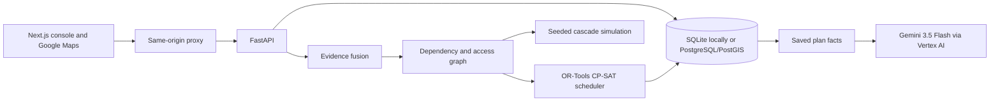

# STORMCHAIN-X

**Cyclone recovery planning when the reports are incomplete.**

After a cyclone, a road report may arrive late, two sources may disagree about
a substation, or an asset may have no report at all. STORMCHAIN-X keeps those
cases visible while it maps infrastructure dependencies and schedules repairs
within a budget and available crews. Add a report, recalculate, and compare the
new plan with the saved one.

**[Open the demo](https://stormchain-web-70530354318.asia-south1.run.app/)**

This is a hackathon decision-support prototype for the Cyclone Impact &
Infrastructure Vulnerability Forecaster track. The district, assets, reports,
costs, and repair times are synthetic. It does not operate real infrastructure.

## Try it

1. Select an asset on the map. Inspect its observations, confidence, and
   dependencies. Missing evidence stays unknown.
2. Generate a recovery plan. Check the chosen actions, budget, crews, road
   prerequisites, and solver status.
3. Report a blocked **Highway 101 (synthetic)** and recalculate. The comparison
   shows any added, removed, or rescheduled actions. The result comes from the
   saved evidence and solver, so a change is not guaranteed.
4. Ask Gemini about the plan. Open **Saved facts cited** to inspect the records
   behind its answer.

See the [demo guide](docs/demo.md) for a five-minute walkthrough.

## Architecture



Each plan saves the scenario and evidence snapshot used to make it. Evidence
fusion weighs report confidence, source reliability, and age. The graph models
dependencies and road access. Seeded Monte Carlo runs explore possible
cascades; the recovery scheduler separately chooses feasible actions under
budget, crew, and access constraints. Its verification list is a heuristic,
not a formal value-of-information calculation.

Gemini explains saved plan facts. It selects a bounded set of read-only records;
the API checks those IDs and the citations in its answer. Gemini does not set
failure probabilities or choose the repair schedule. Vertex AI is preferred
when configured; a server-side Gemini API key also works locally.

## Stack

| Layer | Technology |
|---|---|
| Console | Next.js, TypeScript, Google Maps JavaScript API |
| API | Python 3.12, FastAPI, SQLAlchemy (async), Pydantic |
| Data | SQLite for the demo, PostgreSQL/PostGIS for containers |
| Engine | NetworkX dependency graph, stdlib seeded Monte Carlo, OR-Tools CP-SAT |
| AI | Gemini 3.5 Flash through Vertex AI or the Gemini API, with cited facts |

Monte Carlo uses the Python standard library on purpose. NumPy and GeoPandas
were not needed for a graph this size, and leaving them out keeps the API image
small.

## Live deployment

The demo runs on Google Cloud Run in `asia-south1`: one service for the console
and one for the API. The console calls the API through a server-side proxy that
adds the operator token, so the token never reaches the browser. The hosted demo
uses a disposable SQLite database that resets to the seeded scenario when the
API restarts. See the [deployment notes](docs/deployment.md).

## Configuration

| Variable | Where | Purpose |
|---|---|---|
| `OPERATOR_TOKEN` | API, console server | Shared token required for write requests |
| `DATABASE_URL` | API | Defaults to SQLite; set for PostgreSQL |
| `GEMINI_API_KEY` | API | Optional. Enables Gemini plan explanations |
| `GOOGLE_CLOUD_PROJECT`, `GOOGLE_CLOUD_LOCATION` | API | Optional. Use Vertex AI with existing credentials |
| `API_URL` | Console server | Where the proxy sends API requests |
| `NEXT_PUBLIC_GOOGLE_MAPS_API_KEY` | Console build | Browser map key. Public by design; restrict it by HTTP referrer and API |

Without a Gemini setting, `POST /api/v1/briefings` returns 503 and the rest of
the app works normally.

## Limits

- All data is synthetic, and the scenario is one fixed district.
- The shared operator token is prototype access control, not user
  authentication. Anyone who can open the console can write.
- Explanations describe saved plan facts. They are not a forecast or a
  benchmark of answer accuracy.

## File structure

```text
apps/api/              FastAPI routes, models, schemas, services, fixtures, tests
apps/web/              Next.js console, Google map, API proxy, browser tests
docs/                  Architecture, API, design, demo, verification evidence
scripts/               Local launcher and quality checks
docker-compose.yml     Local PostgreSQL/PostGIS and API containers
.env.example           Environment variable names, no secrets
```

The [structure guide](docs/structure.md) names the main modules. See the
[API contract](docs/api.md) and [architecture decisions](docs/architecture.md)
for details.

## Run and check locally

Install Python 3.12, [uv](https://docs.astral.sh/uv/), and Node.js. On Windows:

```powershell
uv venv .venv
uv pip sync --python .venv/Scripts/python.exe apps/api/requirements-dev.lock
npm.cmd ci --prefix apps/web
./scripts/dev.ps1
```

Open `http://127.0.0.1:3000`. The launcher uses a disposable SQLite demo and
starts the API and console together. Set `NEXT_PUBLIC_GOOGLE_MAPS_API_KEY` in
ignored `apps/web/.env.development.local` for the basemap. For Gemini briefings,
configure the API server with `GOOGLE_CLOUD_PROJECT` and
`GOOGLE_CLOUD_LOCATION` plus existing Application Default Credentials, or a
server-side `GEMINI_API_KEY`. See [local development](docs/local-development.md).

```powershell
.venv/Scripts/python.exe scripts/verify.py
npm.cmd --prefix apps/web run typecheck
npm.cmd --prefix apps/web run build
```

With both servers running, `npm.cmd --prefix apps/web run test:browser` checks
the console. [Verification notes](docs/phase-4-status.md) record the latest
results and open checks. [AGENTS.md](AGENTS.md) contains repository rules.
