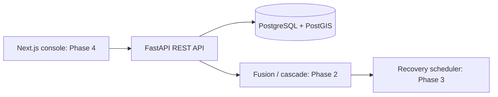

# Accepted architecture

Use one repository and a modular FastAPI monolith. Add one Next.js console
in Phase 4. Keep graph, fusion, cascade, and scheduling logic inside the API
process until measured workloads justify workers.

Python 3.12, Pydantic v2, SQLAlchemy 2.1 async sessions, asyncpg, and PostgreSQL 16
form the backend foundation. SQLite with aiosqlite supports local development;
it stores GeoJSON but has no PostGIS spatial operations.

SQLAlchemy metadata defines portable tables. A generated PostgreSQL schema
records their DDL; a checked-in spatial migration adds a generated PostGIS
geometry column and GiST index. Tests check schema drift.

Use an explicit bootstrap command; API startup never overwrites or seeds data.
Bind local services to loopback. Observation writes require an operator token.
Public deployment needs authentication and request throttling before launch.

Next.js, OR-Tools, and optional model versions will be verified and pinned
in their implementation phases. Do not carry old Next.js 14 or Gemini 1.5
version recommendations forward automatically.

No queues, Redis, LLM, or extra geospatial libraries in Phase 1.

Phase 2 adds NetworkX 3.7 and a bounded standard-library Monte Carlo engine.
Snapshots and outputs are stored in `simulation_runs`; no worker service,
NumPy, or optimizer dependency is introduced. See [engine semantics](phase-2-engine.md).
